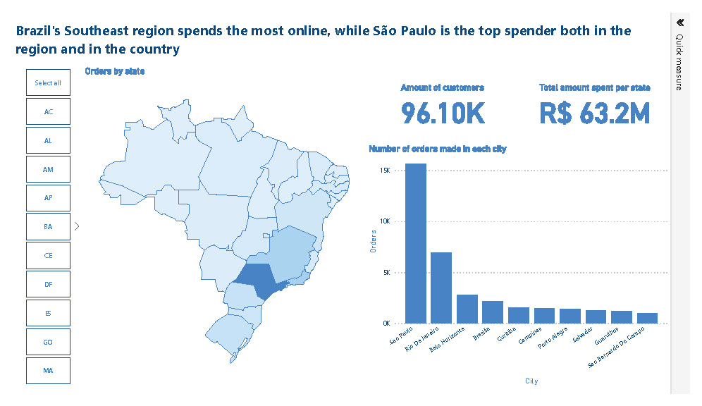
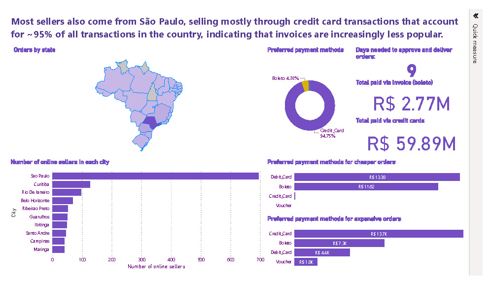
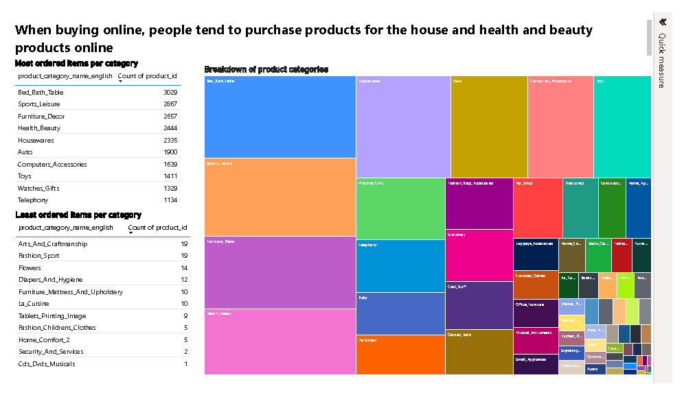

# Brazilian e-commerce analysis

This project analyses e-commerce in Brazil using data published by Olist. Online shopping has become increasingly popular in Brazil, as more and more people have access to internet (177.01M,~77% of the population) and mobile devices, facilitating online shopping. In 2023 72.42% of the population have a mobile device, and penetration is forecasted to increase to 97% by 2029 (Statista.com). However, given the countries socio-economic inequality the adoption and growth of e-commerce hasn't been evenly distributed in Brazil. The analysis providing a snapshot view of e-commerce in the country and explores some key indicators. For this purpose three dashboards were created in PowerBI, using data provided by [Olist](https://www.kaggle.com/datasets/olistbr/brazilian-ecommerce).

## Installation instructions

The data necessary to load the dashboard is provided, as well the .pbix file. For the map of Brazil use the file *br-states.json*, as the map keys are the abbreviations of state names, matching our data.

## Requirements

- Files required:
    -*br-states.json*.
    -Olist dataset provided as zip file *analysis-brazilian-e-commerce-dataset.zip*.
- PowerBI to visualise the dashboards.
- Python (Pandas package) to clean and manipulate dataset.

## Data sources and datasets

The dataset was kindly provided by Olist, and can be found [here](https://www.kaggle.com/datasets/olistbr/brazilian-ecommerce).

## Navigation guide

To navigate the **Customer** dashboard you can select the state by clicking on the map of Brazil, or by selecting the appropriate tile to the left of the map. Data should update accordingly. In addition to that, there is a bookmark that focuses on São Paulo. You can navigate the **Sellers** dashboard by selecting the state on the map. The **Products** dashboard is static, providing a snapshot view of top selling products and their categories.

## Dashboard features

Dashboard features include:

- Interactive map of Brazil showing the states.
- Cards showing key figures.
- Histograms ranking the top 10 cities in the selected  state.
- Donut chart showing the preferred payment methods.
- Tree map showing a breakdown of product categories and their popularity.
- Two tables ranking the top 10 most and least sold products per category.

## Demonstration

Below you'll find a preview of the dashboards.

### Customers

### Sellers

### Products

